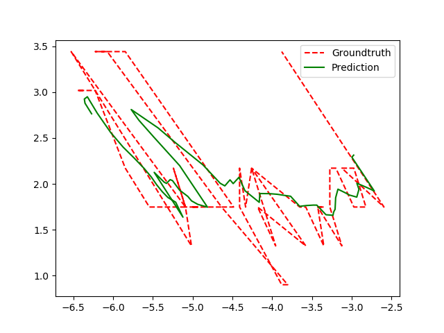

# class-tracker

  

```class-tracker``` is a C++ library that implements both an Extended Kalman Filter (EFK) and an Unscented Kalman Filter (UKF), based tracker.

The tracker only works on the position of the object ```(x,y)``` to predict not only the new position ```(x’,y’)```, but also the velocity ```v``` the yaw , and the yaw-rate . Hence, the state of EKF is: 


While the state transition adopted: 


It is important to know that the filter expects to receive data in meters and returns:
 - ```(x',y')``` in meters
 - ```v``` in m/s
 -  in radians
 -  in radians/second


Moreover, it is important to set the correct ```delta t``` and the wanted age factor when using the tracker as a library.

 ## Dependencies 

```
sudo apt-get install libeigen3-dev python3-matplotlib libpython3.6 

```

This library also depends upon: 
- [matplotlib-cpp](https://github.com/lava/matplotlib-cpp) for visualization
- [geotedic_utils](https://github.com/ethz-asl/geodetic_utils) for the convertion from GPS to meters

## Building this repo
```
git clone https://github.com/mive93/tracker_CLASS
cd class-tracker
git submodule update --init --recursive
mkdir build
cd build
cmake -DCMAKE_BUILD_TYPE=Release ..
make -j4
```

Optionally
```
cmake -DCMAKE_BUILD_TYPE=RelWithDebInfo .. 
cmake -DCMAKE_BUILD_TYPE=Debug ..
```

## Running the demo

This repository offers a library to exploit the implemented filter, however, there is also a dummy example of the usage of the trackers given by the program ```tracker```. Once the project has been built, it can just be run with:
```

./tracker
```

It exploits the file ```../data/test_ll.txt``` in which in each line there is 

- frame number
- timestamp
- latitude (GPS)
- longitude (GPS)

and it shows how to convert them into meters using the geodetic_converter. 

Once run, it will show the ground-truth (noisy positions) in red and the output of the filter (the prediction of EKF of UKF) in green as in this picture:




<!-- Acknowledgements -->

# Acknowledgements
 
This work has been supported by the EU H2020 project CLASS, contract #780622.
